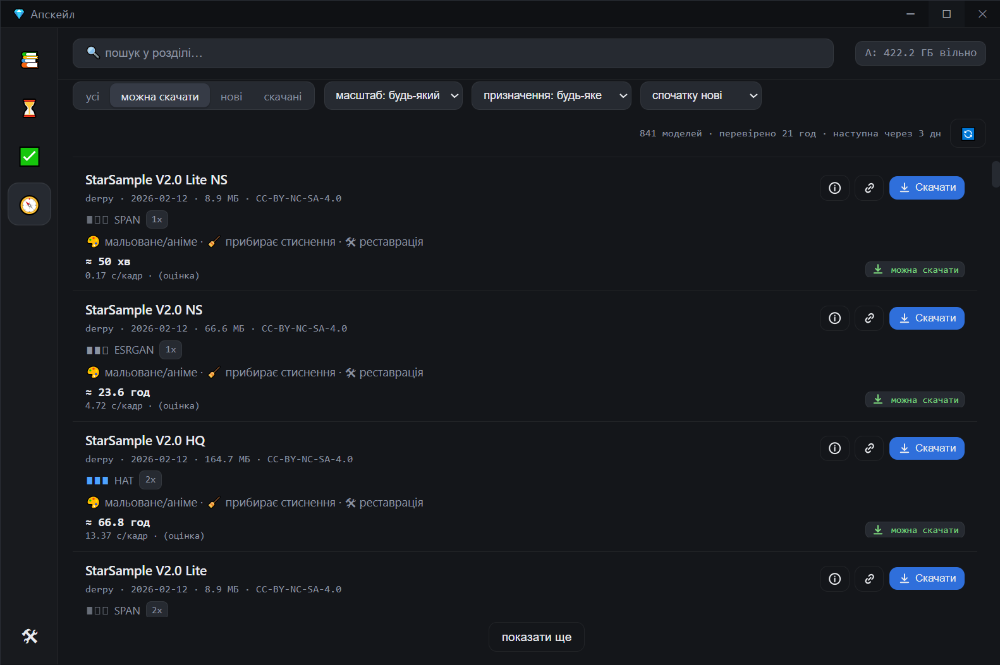

# 💎 Apskeyl — local AI video upscaling to Full HD / 2K / 4K

**English** · [Русский](README.md)

> **Alpha.** Used daily by the author on Windows, but it is a manual install and may break
> on your hardware. Bugs and requests → [Issues](https://github.com/life332/apskeyl/issues).

A desktop app: add videos to a library → click one → **Enhance** → pick **what**
(Full HD / 2K / 4K) and **how** (which model) → queue it. Everything runs on your own GPU,
nothing is uploaded anywhere.



## What it does

- **Preview before you render** — a single frame in seconds or a 10-second clip in ~1–2
  minutes, with a before/after slider and A/B toggle. The point: see the result **before**
  giving the GPU hours of work. The preview is taken from the most dynamic scene, not the intro.
- **Honest ETA.** Estimates come from your own measurements and get recalibrated after every
  preview. If a model will take 20 hours, you see it in yellow before you start.
- **Two engines.** Vulkan (any GPU, `.param/.bin` models) and optionally
  PyTorch + CUDA + TensorRT (NVIDIA) — **2.5× faster** on heavy models and loads
  `.pth/.safetensors` directly, which unlocks most of OpenModelDB.
- **Model catalogue 🧭** — 670+ models from OpenModelDB and HuggingFace mirrors with
  description, author, license and approximate speed; ~300 of them install with one click,
  sha256-verified. Checks for new models every 4 days.
- **Quality rating on your own footage** — LPIPS measured on native recordings from your
  library, so the ranking reflects your material, not somebody's sample images.
- **A queue that survives everything:** segmented pipeline (peak temp files ~10 GB instead
  of 136 GB for a 10-minute 4K video), disk guard, hang guard, resume after a killed process,
  duration check before the final write.
- **Fast path without AI** (lanczos + sharpening + NVENC) — minutes instead of hours when the
  source is already clean.
- UI in English / Russian / Ukrainian. libx264 or HEVC NVENC output.

## Honest numbers

Measured on **RTX 3080 Ti 12 GB + i7-13700K**, 1080p input → 4K, 10-minute video:

| Model | s/frame | 10 min 1080p → 4K | Use |
|---|---|---|---|
| ⚡ no AI (lanczos+cas) | ~0.02 | **≈ 4 min** | clean sources |
| `realesr-animevideov3` ×2 | 0.21 | ≈ 1.1 h | anime, cartoons |
| `realesr-general-x4v3` | 0.58 | ≈ 2.9 h | balanced |
| `4x-UltraSharp` — Vulkan engine | 4.6 | ≈ 23 h | maximum detail |
| `4x-UltraSharp` — TensorRT engine | **1.84** | **≈ 9 h** | same, 2.5× faster (SSIM 0.997 vs Vulkan) |

Other GPUs → other numbers: the app measures yours after the first preview.

## Honest limits

- **On clean 1080p a neural net is nearly pointless:** +12 % sharpness and +22 % halos
  compared with good lanczos. It shines on ≤720p, old and heavily compressed video. The app
  tells you per file whether AI is worth it.
- **Flicker.** Frame-by-frame GAN models can "breathe" on motion. Partially mitigated
  (film grain, soft blend); there are no temporal models here.
- **Windows 10/11 only**, needs the WebView2 runtime (built into Windows 11; comes with Edge on 10).
- **Disk.** 4K renders produce tens of GB of temporary frames. Keep the data folder on a big
  drive — the app asks on first start.
- **Model licenses.** The best-looking models (UltraSharp, Siax, LSDIRplus…) are
  **non-commercial** (CC BY-NC-SA). For paid work use the Real-ESRGAN models (BSD).
  Details in [THIRD_PARTY.md](THIRD_PARTY.md).

## Install

You need [Python 3.11+](https://www.python.org/downloads/) (tick *Add to PATH*). Then in PowerShell:

```powershell
git clone https://github.com/life332/apskeyl.git
cd apskeyl
powershell -ExecutionPolicy Bypass -File tools\setup.ps1
tools\apskeyl.cmd
```

`setup.ps1` creates a small venv (~60 MB) and downloads ffmpeg (~90 MB) and
realesrgan-ncnn-vulkan with the base models (~45 MB) into `tools\bin\`. Nothing is written
outside the app folder. The first start asks where to keep your data.

**Engine 2 (NVIDIA, optional, ~8 GB):**

```powershell
powershell -ExecutionPolicy Bypass -File tools\setup_engine2.ps1
```

After that, `.pth` models from the 🧭 catalogue install with one click and heavy models run
through TensorRT.

Already have ffmpeg / realesrgan? `setup.ps1 -SkipTools` and set
`APSK_TOOLS=<folder with the binaries>` (or `tools_dir` in `apskeyl.json`).

## Usage

1. **Library** → "Add video" (or drop files into the `inbox` folder inside your data folder).
2. Click a video → the right panel shows its passport and a recommendation: AI or not.
3. **Enhance** → pick the target (Full HD / 2K / 4K — the tiles honestly show what this
   file will actually get) and the model.
4. **1-frame preview** → if you like it, **10 seconds** → if you like it, **queue**.
5. Results are in the "Done" tab and in the `out` folder (changeable in 🛠).

## How it is built

`app/server.py` — FastAPI on `127.0.0.1:8391`, runs as its own process (closing the window
does not stop a render; it exits after 30 idle minutes). `app/desktop.py` — pywebview/WebView2
window. `app/jobs.py` — queue and segmented pipeline. `app/engine.py` — ffmpeg/engine
commands. `app/engine2_runner.py` — the PyTorch/TensorRT engine in its own venv.
`app/scout.py` — model catalogue. `web/` — a framework-free UI.

## Support

Free, and staying free. If it saved you hours:

| | address |
|---|---|
| USDT (TRC20, Tron) | `TFR2sxzLKrDRnZNxWYP4WhkxrownQdCNBV` |
| USDT / ETH (Arbitrum One — lowest fees) | `0xE6bDf3431F6981CD2A15851084917984036A3641` |
| ETH / USDT (ERC20, Ethereum) | `0xE6bDf3431F6981CD2A15851084917984036A3641` |
| BTC | `bc1qpdzm0cumyag9tm822kdy8vq88f4ejc46j4k77h` |

## License

Code — [MIT](LICENSE). Third-party components and models keep their own licenses, see
[THIRD_PARTY.md](THIRD_PARTY.md). The app talks to the network only to download the model
catalogue and the models you click.
